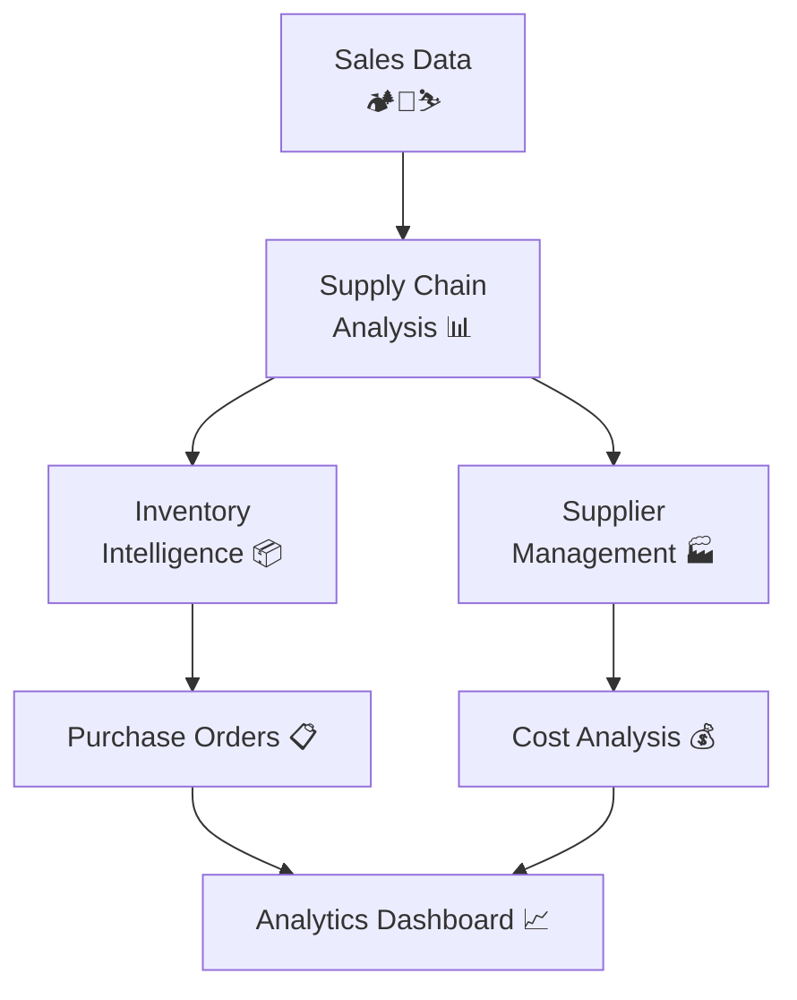

# 🚀 Enterprise Data Generation Platform

**Two-Feature System**: Sales & Finance → Supply Chain & Inventory

---

## 🏗️ System Architecture

```
📁 Sales Data (Input) → 📊 Supply Chain Analysis → 📦 Inventory Intelligence
   ↓                      ↓                        ↓
🏕️ Camping Sales        📈 Demand Analytics      📋 Purchase Orders
🍳 Kitchen Sales   →    💰 Cost Analysis    →   📊 Stock Levels  
⛷️ Ski Sales           🚚 Supplier Mapping     📈 4-Chart Dashboard
```

---

## ✅ Feature 1: Sales & Finance Data Generation

**Status**: ✅ **COMPLETED**

| Domain | Output | Main Generator |
|--------|---------|----------------|
| 🏕️ **Camping** | 6 CSV files | `generate_camping_orders.py` |
| 🍳 **Kitchen** | 6 CSV files | `generate_kitchen_orders.py` |
| ⛷️ **Ski** | 6 CSV files | `generate_ski_orders.py` |

**Quick Start**: `python main_generate_sales.py --enable-growth --graph --copydata`

---

## 🔨 Feature 2: Supply Chain & Inventory

**Status**: 🔨 **ACTIVE DEVELOPMENT**

```
📊 Analyzes 56,457+ Sales Records
           ↓
🏭 Generates Supply Chain Intelligence
           ↓
📦 8 CSV Files + Analytics Dashboard
```

### Core Components

| Module | Purpose | Output Files |
|--------|---------|--------------|
| **Suppliers** | Master data + relationships | 3 CSV files |
| **Inventory** | Stock levels + orders | 4 CSV files |
| **Analytics** | Professional dashboard | PNG charts |

**Quick Start**: `python main_generate_supplychain.py --graph --copydata`

---

## 📊 Data Flow Diagram



---

## 🎯 Key Features

| Feature | Sales Generator | Supply Chain Generator |
|---------|----------------|----------------------|
| **Scale** | 56,457+ records | Demand-driven analysis |
| **Domains** | 3 Business areas | Cross-domain suppliers |
| **Output** | 18 CSV files | 8 CSV files + charts |
| **Analytics** | Revenue trends | 4-chart dashboard |
| **Integration** | Standalone | Uses sales data |

---

## 🚀 Quick Commands

### Sales & Finance
```bash
# Complete 6-year dataset with growth
python main_generate_sales.py --enable-growth --graph --copydata

# Custom date range  
python main_generate_sales.py -s 2025-01-01 -e 2026-03-02
```

### Supply Chain
```bash
# Full supply chain analysis
python main_generate_supplychain.py --graph --copydata

# Production scale
python main_generate_supplychain.py --graph --num-orders 50 --num-transactions 800
```

---

## 📁 Output Structure

```
📦 datagen/
├── 📁 src/data_generator/output/     # Local generation
│   ├── 🏕️ camping/
│   ├── 🍳 kitchen/  
│   ├── ⛷️ ski/
│   ├── 📦 suppliers/
│   ├── 📋 inventory/
│   └── 📊 *.png (dashboards)
│
└── 📁 infra/data/                    # Infrastructure ready
    ├── 🏕️ camping/ 
    ├── 🍳 kitchen/
    ├── ⛷️ ski/
    ├── 📦 suppliers/
    ├── 📋 inventory/
    └── 📄 *.md (summaries)
```

---

## 💡 Smart Defaults

| Generator | Default Timeline | Auto-Scaling |
|-----------|------------------|--------------|
| **Sales** | 6 years → today | Customer growth patterns |
| **Supply Chain** | 2025-01-01 → today | Sales-driven demand (425+ days) |

**Pro Tip**: Use `--copydata` to auto-organize files for deployment! 🎯

---

## 🛠️ Tech Stack

- **Core**: Python + Pandas + NumPy
- **Analytics**: Matplotlib (4-chart dashboards)  
- **Config**: JSON-driven supplier relationships
- **Output**: CSV + PNG + Markdown reports

**Dependencies**: `pip install -r requirements.txt`

---

*Last Updated: March 3, 2026 | Enterprise Data Generation Platform v2.0*